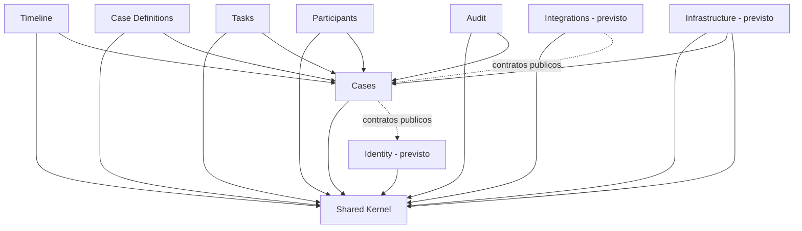

# ADR-001 - Modular Monolith Architecture

| Campo    | Valor                |
|----------|----------------------|
| Producto | Caimmand             |
| Version  | 0.1                  |
| Estado   | Accepted             |
| Fecha    | 2026-07-13           |
| Autor    | CAI Process Grid Team |

> Caimmand no ejecuta el negocio; hace visible, gobernable y operable su ejecucion.

## Tabla de contenidos

1. [Estado](#estado)
2. [Fecha](#fecha)
3. [Contexto](#contexto)
4. [Problema](#problema)
5. [Decision](#decision)
6. [Principio arquitectonico: Case First Architecture](#principio-arquitectonico-case-first-architecture)
7. [Organizacion modular](#organizacion-modular)
8. [Comunicacion entre modulos](#comunicacion-entre-modulos)
9. [Shared Kernel](#shared-kernel)
10. [Dependencias](#dependencias)
11. [Alternativas consideradas](#alternativas-consideradas)
12. [Consecuencias](#consecuencias)
13. [Impacto sobre el desarrollo](#impacto-sobre-el-desarrollo)
14. [Decisiones derivadas](#decisiones-derivadas)
15. [Principios finales](#principios-finales)

## Estado

Proposed.

Este ADR se encuentra en estado Proposed. Una vez revisado y aprobado por el equipo de arquitectura de CAI Process Grid, su estado pasara a Accepted y operara como referencia arquitectonica obligatoria para toda decision posterior de estructura interna del sistema. La transicion de Proposed a Accepted podra implicar el ajuste de redaccion, pero no la Decision aqui registrada: una vez Accepted, un ADR solo puede ser superado por un ADR posterior que lo reemplace explicitamente.

## Fecha

2026-07-13.

## Contexto

Caimmand comienza como un producto nuevo dentro del ecosistema CAI Process Grid. Su responsabilidad no es ejecutar procesos de negocio, sino administrar Casos, mantener el estado del Caso, registrar la historia funcional (Timeline), registrar la auditoria tecnica, coordinar la interaccion humana, mantener la trazabilidad completa y ofrecer un punto unico de operacion. La automatizacion, la ejecucion de procesos y los workflows pertenecen a otros componentes del ecosistema o a herramientas externas, y los Casos siempre son creados por sistemas externos mediante la API publica de Caimmand (la Command API).

El dominio de Caimmand, definido en el DomainModel, esta compuesto por multiples capacidades:

- Cases (Casos)
- Case Definitions (Definiciones de Caso)
- Timeline (Cronologia funcional)
- Tasks (Tareas)
- Participants (Participantes)
- Audit (Registro de Auditoria)
- Identity (Identidad y acceso) - modulo previsto
- Integrations (Integraciones con sistemas externos)

Aunque existen multiples capacidades, todas forman parte de una unica aplicacion y poseen un fuerte grado de cohesion. Timeline no tiene sentido sin un Caso. Task no tiene sentido sin un Caso. Participant no tiene sentido sin un Caso. Audit no tiene sentido sin un Caso. El Caso es el centro gravitacional del dominio, y todas las demas capacidades orbitan alrededor de el.

El MVP, definido en el documento correspondiente, no justifica una arquitectura distribuida. El volumen de operacion, el numero de integraciones y la cantidad de equipos involucrados no alcanzan el umbral a partir del cual los costos de un sistema distribuido se compensan con sus beneficios. Introducir distribucion prematuramente generaria complejidad operativa, latencia de comunicacion, dificultad de consistencia y carga cognitiva innecesarias para un producto que aun esta validando su propuesta de valor.

Construir inicialmente una arquitectura por capas tradicionales (presentacion, logica de negocio, datos) presenta riesgos significativos: el acoplamiento horizontal entre dominios proliferaria, los limites entre capacidades se difuminarian, las dependencias se designarian por afinidad tecnica y no por coherencia de negocio, y el sistema evolucionaria hacia un "Big Ball of Mud". Una vez instalado el acoplamiento, separar dominios posteriormente seria costoso y propenso a errores.

## Problema

El problema central que este ADR aborda es la estructura interna del sistema:

¿Como estructurar Caimmand para que:

- tenga alta cohesion por capacidad de negocio?
- tenga bajo acoplamiento entre modulos?
- sea facil de evolucionar sin reescrituras grandes?
- permita agregar nuevos modulos sin alterar los existentes?
- permita eventualmente separar modulos en unidades independientes si fuera necesario?
- evite derivar en un "Big Ball of Mud"?

La decision sobre la estructura interna determina la evolucion del producto durante los proximos anios. Una decision erronea aca condiciona la velocidad de entrega, la estabilidad y la capacidad de adaptacion a futuros requerimientos.

## Decision

Caimmand adopta una arquitectura Modular Monolith orientada al dominio.

La division principal del sistema sera por modulos de negocio y NO por capas tecnicas. Cada modulo representa un bounded context interno del dominio de Caimmand. Los modulos se organizan alrededor de las capacidades del producto, no alrededor de la decomposition tecnica tradicional (presentacion/aplicacion/dominio/infraestructura).

Modulos previstos como unidades de descomposicion principal:

- Cases (Casos)
- Case Definitions (Definiciones de Caso)
- Timeline (Cronologia funcional)
- Tasks (Tareas)
- Participants (Participantes)
- Audit (Registro de Auditoria)
- Identity (Identidad y acceso) - previsto
- Integrations (Integraciones externas)

Cada modulo:

- encapsula completamente su logica de negocio;
- es responsable de sus propias reglas de negocio y validaciones;
- es responsable de sus entidades y casos de uso;
- es responsable de su persistencia, exponiendola solo a traves de su interfaz publica;
- expone una interfaz publica estable que define el contrato con el resto del sistema;
- no accede a la persistencia interna de otros modulos.

El acceso directo entre persistencias de distintos modulos esta prohibido. Toda interaccion entre modulos se canaliza a traves de las interfaces publicas, los servicios de aplicacion y los eventos de dominio o de integracion.

## Principio arquitectonico: Case First Architecture

Se introduce formalmente el principio Case First Architecture como uno de los principios fundamentales de Caimmand.

Case First Architecture es la formulacion arquitectonica del Principio 1 del PDD ("El eje del producto es el Caso"). El PDD define el principio a nivel de producto; Case First Architecture lo opera a nivel de arquitectura de software, estableciendo las reglas de diseno que lo materializan dentro del sistema.

### Definicion

Todo el modelo operativo gira alrededor del Caso. No existen entidades operativas independientes del Caso. En particular:

- Timeline pertenece a un Caso.
- Task pertenece a un Caso.
- Participant pertenece a un Caso.
- Audit pertenece a un Caso.

Toda interaccion del sistema que modifique el estado operativo de Caimmand debe estar asociada exactamente a un Caso. No existe operacion funcional descontextualizada de un Caso.

### Por que simplifica el modelo de dominio

Case First Architecture establece una direccion unica de dependencia: todos los modulos operativos apuntan al Caso, y ningun Caso apunta a un modulo operativo concreto. Consecuencias:

- el modelo se razona a partir de una sola entidad central;
- toda nueva capacidad se incorpora como satelite del Caso, no como entidad paralela;
- los modulos operativos pueden reemplazarse, extraerse o evolucionar sin que el Caso cambie;
- la consistencia del dominio se preserva porque todas las reglas validan en torno a la existencia y el estado del Caso.

Case First Architecture es la regla maestra de diseno interna. Cualquier propuesta que enfrente a un modulo operativo con el Caso, o que introduzca entidades operativas independientes del Caso, contradice este ADR y debe ser explicitamente justificada o rechazada.

## Organizacion modular

La organizacion modular propuesta responde a las capacidades del dominio y del MVP. Cada modulo es un bounded context interno con frontera arquitectonica explicita. No se describen clases, proyectos ni artefactos de implementacion: las descripciones son exclusivamente de responsabilidades arquitectonicas.

### Cases (Casos)

Modulo central del sistema. Administra el ciclo de vida del Caso, su estado, su contexto y su identidad. Es elmodulo que todos los demas modulos operativos referencian. Expone la interfaz publica para la creacion y operacion de Casos, incluyendo los comandos que el resto del sistema y los sistemas externos invocan a traves de la Command API.

### Case Definitions (Definiciones de Caso)

Modulo responsable de la tipificacion de los Casos. Administra las Case Definitions, sus atributos (codigo, nombre, descripcion, categoria opcional, estados admisibles, valores por defecto, presentacion) y sus estados de activacion. Cases consulta Case Definitions al crear un Caso, pero Case Definitions no conoce Cases directamente.

### Timeline (Cronologia funcional)

Modulo responsable del registro y la consulta de los eventos funcionales visibles del Caso. Timeline no conoce Tasks, ni Audit, ni Case Definitions: solo conoce el Caso al que pertenecen sus eventos y los participantes que los originan.

### Tasks (Tareas)

Modulo responsable del registro y la consulta de tareas asociadas a un Caso. Tasks no es un motor BPM: no ejecuta trabajo ni orquesta la secuencia de tareas. Tasks registra el trabajo pendiente y su resultado, pero la ejecucion real vive fuera de Caimmand. Tasks no conoce Timeline, ni Audit, ni Case Definitions.

### Participants (Participantes)

Modulo responsable del modelo de actores que intervienen en un Caso: personas externas, usuarios internos, sistemas externos y agentes de IA. Participants no conoce Timeline, ni Tasks, ni Audit. Cases referencia Participants al asignar responsables, registrar eventos y registrar autorias.

### Audit (Registro de Auditoria)

Modulo responsable del registro tecnico inmutable de los cambios, accesos y operaciones realizadas sobre el dominio. Audit no es funcional ni visible en la operacion diaria: existe para el cumplimiento, la trazabilidad tecnica y la reconstruccion forense. Audit registra sobre Casos y sobre entidades asociadas, pero no conoce la logica de Timeline, ni de Tasks, ni de Case Definitions.

### Identity (Identidad y acceso) - previsto

Modulo arquitectonico previsto responsable de la autenticacion y autorizacion de los usuarios internos de Caimmand y de los sistemas externos. Identity emite los tokens y resuelve los roles (Operador, Supervisor, Gerente) que despues Cases y los demas modulos consultan para autorizar comandos. Identity no属于 formalmente al dominio operativo definido en DomainModel, pero es indispensable arquitectonicamente y se incorpora a la estructura modular desde el inicio.

### Integrations (Integraciones externas) - previsto

Modulo arquitectonico previsto responsable de la comunicacion con sistemas externos via Command API. Implementa los adaptadores de entrada (recepcion de comandos desde sistemas de origen y automatizaciones) y los adaptadores de salida (notificaciones hacia sistemas externos cuando corresponda). Integrations nunca contiene logica de negocio: traduce contratos externos a comandos internos y viceversa.

### Infrastructure (Infraestructura) - previsto

Modulo arquitectonico previsto con responsabilidades transversales de soporte tecnico: mecanismos de persistencia, conectividad, configuracion y otros detalles de implementacion que el dominio no conoce. Infrastructure depende del dominio, nunca al reves: los modulos de negocio definen los contratos que Infrastructure implementa (inversion de dependencias).

### Shared Kernel (Nucleo Compartido)

Modulo transversal que contiene elementos compartidos por todos los modulos. No es un modulo de negocio: es un contrato comun. Su contenido esta estrictamente acotado y descrito en la seccion [Shared Kernel](#shared-kernel).

## Comunicacion entre modulos

Los modulos se comunican exclusivamente mediante:

- interfaces publicas: contratos estables publicados por cada modulo, consumidos por el resto;
- servicios de aplicacion: casos de uso publicados por un modulo e invocados por otros;
- eventos de dominio: notificaciones internas emitidas por un modulo tras una transicion o cambio relevante;
- eventos de integracion: notificaciones emitidas hacia sistemas externos cuando corresponda, canalizadas a traves del modulo Integrations.

Nunca se comunican mediante:

- acceso directo a tablas o mecanismos de persistencia internos;
- acceso directo a repositorios internos de otros modulos;
- llamadas a infraestructura interna de otros modulos.

### Por que

- Preserva boundaries: cada modulo mantiene el control de su estado y su invariante. Si un modulo accede a otro por su persistencia, cualquier cambio interno rompe al consumidor.
- Facilita extraccion futura: un modulo que solo se comunica por contratos puede ser extraido a un proceso independiente sin que sus consumidores noten la diferencia.
- Evita acoplamiento: el acoplamiento por datos es el mas fragil y el mas dificil de revertir. El acoplamiento por contratos es explicito, versionable y refactorizable.
- Mantiene consistencia: el modulo dueno del dato es el unico que puede cambiarlo, lo que elimina estados inconsistentes producto de mutaciones cruzadas.

El acceso directo a la base de datos esta prohibido tambien para sistemas externos: la Command API es el unico punto de entrada autorizado, coherente con el Principio 4 del documento de arquitectura.

## Shared Kernel

Se define la existencia de un Shared Kernel (Nucleo Compartido) como modulo transversal de contratos comunes.

### Que pertenece al Shared Kernel

- Identificadores de entidades compartidas (Case Id, Case Definition Id, Task Id, Participant Id, Audit Record Id): los identificadores son estables y compartidos, no las entidades mismas.
- Value Objects comunes no asociados a un unico modulo (por ejemplo, marcas temporales, rangos, cotas, tipos de participante, tipos de evento).
- Tipos de resultado estandar para propagar exito o error sin recurrir a excepciones como flujo normal (por ejemplo, Result<T>).
- Errores compartidos: catalogo de errores comunes que se utilizan transversalmente.
- Contratos compartidos: interfaces que varios modulos deben implementar o consumir (por ejemplo, contrato de publicacion de eventos de dominio).
- Eventos base: estructura comun que todos los eventos de dominio e integracion respetan.
- Utilidades del dominio: pequenas abstracciones puras que no pertenecen a ningun modulo concreto (por ejemplo, primitivas de validacion de invariantes).

### Que NO debe terminar en Shared Kernel

- Logica de negocio: el Shared Kernel no contiene reglas de dominio, solo contratos.
- Reglas especificas de un modulo: si una regla solo aplica a Tasks, vive en Tasks.
- Detalles de persistencia: esquemas, repositorios concretos o adaptadores a mecanismos de persistencia.
- Conceptos de negocio complejos: el Shared Kernel no es un repositorio de entidades de dominio; es un repositorio de contratos.
- Dependencias externas: frameworksspecificos, librerias de terceros, acoplamiento a infraestructura.

El Shared Kernel debe ser pequeno y estable. Cualquier adicion debe ser discutida y explicitamente justificada: un Shared Kernel que crece sin disciplina se convierte en un punto de acoplamiento global que erosiona el valor de la modularidad.

Aclaracion: Result<T> es un ejemplo del patron generico de tipos de resultado funcional para propagar exito/error sin utilizar excepciones como flujo normal. Se menciona como ejemplo conceptual de Value Object comun, no como compromiso con un lenguaje o framework especifico.

## Dependencias

Se definen reglas claras para control de dependencias entre modulos.

### Reglas

- No se permiten dependencias circulares entre modulos.
- Timeline no conoce Tasks.
- Audit no conoce Timeline.
- Cases no conoce Infrastructure.
- Infrastructure depende del dominio, nunca al reves.
- Los modulos solo pueden depender de contratos publicos de otros modulos, no de sus implementaciones.
- Todos los modulos pueden depender del Shared Kernel.
- Ningun modulo de negocio depende de Infrastructure.
- Integrations depende de los contratos publicos de los modulos de negocio; nunca al reves.

### Diagrama de dependencias conceptuales

### Lectura del diagrama

- Todos los modulos dependen del Shared Kernel: los contratos comunes son la base compartida.
- Los modulos operativos (Timeline, Tasks, Participants, Audit) dependen de Cases: Case First Architecture materializada en el grafo de dependencias.
- Case Definitions depende de Cases porque Cases consulta definiciones al crear Casos; la relacion se invierte porque Case Definitions no conoce las instancias concretas.
- Integrations e Identity se relacionan con Cases por contratos publicos, no por implementacion.
- Infrastructure depende del dominio y del Shared Kernel; ningunmodulo de dominio depende de Infrastructure.
- No existen flechas entre Timeline, Tasks, Participants y Audit: son satelites independientes del Caso.

### Aclaracion sobre Infrastructure

La dependencia de Infrastructure hacia el dominio representa inversion de dependencias: los modulos de negocio definen abstracciones (interfaces, contratos de persistencia) que Infrastructure implementa. Esto permite que el dominio permanezca agnostico a los mecanismos concretos de persistencia, conectividad y configuracion, mantenerse testeable en aislamiento y autorizado a evolucionar sin quedar atado a una tecnologia concreta.

## Alternativas consideradas

### Arquitectura por capas

#### Descripcion

Estructura tradicional en tres o cuatro capas: presentacion, aplicacion, dominio, datos (o variantes). Cada capa se comunica con la inmediatamente adyacente.

#### Ventajas

- Simple de aplicar al inicio.
- Familiar para equipos con experiencia en frameworks clasicos.
- Permite moverse rapido cuando el dominio es pequeno.

#### Desventajas

- El acoplamiento horizontal entre dominios proliferaria: varios dominios comparten la misma capa de datos y la misma capa de aplicacion.
- Los limites por capacidad de negocio se difuminan: no existe mecanismo arquitectonico para aislar Timeline de Tasks.
- Las dependencias se designan por afinidad tecnica (por capa), no por coherencia de negocio.
- Alta probabilidad de evolucionar hacia un "Big Ball of Mud".
- Dificultad para extraer capacidades en el futuro: la logica de un dominio queda repartida entre capas en lugar de encapsulada en un modulo.

#### Por que fue descartada

Caimmand tiene un dominio nucleado alrededor del Caso, con multiples capacidadessatelites. La arquitectura por capas no preservaria los boundaries entre capacidades y convertiria futuras extracciones de modulos en reescrituras. El riesgo de Big Ball of Mud no es aceptable para un producto Enterprise.

### Microservicios

#### Descripcion

Estructura distribuida en la que cada capacidad (o cada bounded context) se despliega como un servicio independiente, comunicado por red.

#### Ventajas

- Escalado independiente por capacidad.
- Equipos autonomos por servicio.
- Aislamiento de fallos por servicio.
- Independencia de despliegue.
- Fronteras fisicas que fuerzan disciplina de boundaries.

#### Desventajas

- Complejidad operativa elevada: observabilidad distribuida, consistencia eventual, manejo de fallos parciales, idempotencia, reintentos.
- Latencia de comunicacion: toda interaccion interservicio paga costos de red.
- Dificultad de transacciones: una operacion que toca varios modulos ya no es local.
- Carga cognitiva: el equipo debe razonar sobre un sistema distribuido desde el primer dia.
- Costo inicial desproporcionado para un MVP que aun valida su propuesta de valor.

#### Por que fue descartada para el MVP

El MVP no tiene el volumen de operacion, el numero de equipos ni las exigencias de escalado que justifiquen la distribucion. Introducir distribucion prematuramente generaria una friccion operativa que retrasaria la entrega sin aportar valor. Las fronteras fisicas no son necesarias a esta escala: las fronteras logicas bien impuestas en un Modular Monolith son suficientes para preservar los boundaries y dejan abierta la puerta a una futura extraccion selectiva.

### Modular Monolith

#### Ventajas

- Alta cohesion por capacidad de negocio.
- Bajo acoplamiento entre modulos via contratos publicos.
- Despliegue simple: un unico artefacto, una unica base operativa.
- Facilidad de testing: cada modulo se testa en aislamiento dentro de un unico proceso.
- Evolucion incremental: los modulos pueden madurar sin reorganizar el sistema.
- Habilita extraccion futura: si una capacidad necesita escalar o desplegarse de forma independiente, su frontera explicita permite separarla con costo acotado.
- Costo inicial proporcional al MVP: no paga el costo de distribucion sin necesidad de ella.

#### Desventajas

- Requiere disciplina arquitectonica: los boundaries no estan reforzados fisicamente, por lo que dependen de convencion y de revision.
- Riesgo de erosion: sin disciplina, nada impide que un modulo acceda a la persistencia de otro.
- Necesidad de enforcement: el control de dependencias no es automatico; debe ser revisado en code review y, idealmente, por herramientas de validacion.
- Falta de escalado independiente: mientras el sistema sea un monolito, todos los modulos comparten el mismo techo de escalado.

#### Justificacion de la eleccion

Modular Monolith es la eleccion coherente con el contexto del MVP:

- preserva los boundaries entre capacidades;
- no paga el costo de distribucion;
- deja abierta la puerta a extraccion futura de modulos;
- permite concentrar la energia del equipo en validar el dominio y la propuesta de valor, no en operar infraestructura distribuida.

La disciplina arquitectonica requerida es una inversion que protege el producto durante varios anos y crea las condiciones para una futura separacion selectiva si el contexto la justifica. Sin esa disciplina, tanto Modular Monolith como Microservicios derivan en un Big Ball of Mud: la disciplina no la resuelve el patron, la resuelve el equipo.

## Consecuencias

### Consecuencias positivas

- Alta cohesion: cada modulo encapsula una capacidad de negocio completa.
- Bajo acoplamiento: los modulos se comunican por contratos publicos y eventos.
- Facilidad de testing: cada modulo se prueba en aislamiento, dentro de un unico proceso, sin mocks de red.
- Evolucion incremental: nuevos modulos se incorporan siguiendo el patron establecido sin alterar los existentes.
- Despliegue simple: un unico artefacto simplifica el ciclo de entrega.
- Facilidad para extraer modulos en el futuro: si una capacidad necesita escalar o desplegarse de forma independiente, su frontera explicita y su interfaz publica permiten separarla con costo acotado.
- Trazabilidad arquitectonica: cada modulo tiene un dueno y unas responsabilidades identificables.

### Consecuencias negativas

- Mayor disciplina arquitectonica requerida: los boundaries no estan reforzados fisicamente y dependen de convencion.
- Necesidad de respetar limites: cualquier modulo podria, en principio, acceder a otro por su persistencia si la disciplina se relaja.
- Control de dependencias permanente: el control debe ejercerse en revision de codigo y, idealmente, con validacion automatizada que detecte dependencias prohibidas.
- Riesgo de erosion silenciosa: el acoplamiento puede reintroducirse gradualmente sin que se perciba hasta que es costoso de revertir.
- Sin escalado independiente: mientras el sistema permanezca como monolito, todos los modulos comparten el mismo techo de escalado.

Las consecuencias negativas son conocidas y aceptadas. La mitigacion principal es la introduccion explicita de las reglas de dependencias descritas en este ADR, su validacion en el ciclo de desarrollo y la documentacion de toda excepcion mediante un ADR posterior o una seccion de excepciones.

## Impacto sobre el desarrollo

### Organizacion del codigo

El codigo se organizara por modulos de negocio. Cada modulo es responsable de su dominio, su aplicacion, su infraestructura y su interfaz publica. No se organiza por capas tecnicas (toda la presentacion junta, toda la persistencia junta): se organiza por capacidad de negocio con sus capas internas.

### Nuevos modulos

Cualquier nuevo modulo se incorpora siguiendo el patron establecido: define sus entidades, sus casos de uso, su interfaz publica y sus eventos. No accede a la persistencia de otros modulos. Depende del Shared Kernel y, si corresponde, de los contratos publicos del modulo Cases.

### Testing

Cada modulo se prueba en aislamiento dentro del unico proceso. Los tests de un modulo consumen su interfaz publica, no su implementacion. Los tests de integracion pueden ejercitar varios modulos a traves de sus contratos. La simplicidad del despliegue de un unico proceso mantiene cortos los lazos del ciclo de desarrollo.

### Evolucion

Los modulos evolucionan de forma incremental. Un cambio en un modulo no implica modificar otros si el contrato publico se mantiene. Los cambios de contrato son explicitos, versionables y discutidos. Las capacidades transversales (eventos, persistencia, seguridad y observabilidad) se tratan en ADR especificos.

### Mantenibilidad

La asignacion clara de responsabilidades por modulo facilita localizar el codigo afectado por una cambio de requisito, aislar su impacto y razonar sobre invariantes. La asignacion de duenos por modulo refuerza la continuidad arquitectonica.

## Decisiones derivadas

Este ADR define la estructura arquitectonica base de Caimmand. Sirve de fundamento para futuros ADR que detallen decisiones arquitectonicas en capacidades transversales. Se prevén ADR especificos para las siguientes capacidades, a ser numerados y formalizados en sus respectivas iteraciones:

- Persistencia
- Eventos de dominio e integracion
- Integraciones con sistemas externos
- Seguridad y control de acceso
- Observabilidad

Los ADR derivados respetaran este ADR y no podran contradecirlo sin una justificacion explicita y un nuevo ADR que reemplace o complemente la decision aqui registrada.

## Principios finales

Esta seccion consolida los principios arquitectonicos de Caimmand. Operan como guia y como criterio de revision para toda decision tecnica o funcional posterior. Algunos de ellos ya estan formulados en el PDD o en el documento de arquitectura; aqui se reorganizan como principios arquitectonicos.

### Domain First

El dominio guia la arquitectura. Las decisiones arquitectonicas se toman a partir del modelo de dominio, no al reves. La estructura modular sigue los bounded contexts definidos por el dominio, no la conveniencia tecnica.

### Case First

Todo el modelo operativo gira alrededor del Caso. No existen entidades operativas independientes del Caso. Toda interaccion que modifique el estado operativo del sistema esta asociada a un Caso. Caso es la unidad central de gestion, trazabilidad y gobernanza. Este principio es la formulacion arquitectonica del Principio 1 del PDD.

### API First

Toda interaccion externa se canaliza a traves de la Command API. La Command API es el unico contrato publico del producto. Su estabilidad es un activo critico. No se permite acceso directo a la persistencia, ni a repositorios internos, ni a infraestructura. La Command API se disena antes que cualquier consumidor concreto y se mantiene estable ante la evolucion del sistema.

### Modular by Business Capability

La descomposicion principal del sistema es por capacidades de negocio (Cases, Timeline, Tasks, Participants, Audit, etc.), no por capas tecnicas. Cada modulo es un bounded context interno con frontera explicita, dueno identificable y contrato publico. Esta organizacion preserva la cohesion y el acoplamiento a lo largo del tiempo.

### External Systems Through Public APIs

Los sistemas externos (sistemas de origen, automatizaciones, herramientas de orquestacion, agentes IA externos) interactuan con Caimmand exclusivamente a traves de la Command API. No se permite acceso directo a persistencia, ni a repositorios internos, ni a cualquier mecanismo de bypass. Esta regla es absoluta para el MVP y para el producto maduro.

### No Direct Database Access

Ningun sistema externo, automatizacion, ni modulo cruzado accede directamente a la base de datos. Toda modificacion de estado se canaliza a traves del contrato publico del modulo dueno del dato. Esta regla protege la integridad del dominio y habilita la futura extraccion de modulos.

### Explicit Boundaries

Todo modulo tiene una frontera explicita: una interfaz publica, un conjunto de eventos, un dueno y un proposito de negocio. Las dependencias entre modulos se declaran abiertamente y se valida su consistencia con las reglas de dependencias de este ADR. Ningun modulo accede a las entranas de otro.

### Evolutionary Architecture

La arquitectura esta disenada para evolucionar. Las decisiones actuales no comprometen las futuras. Los modulos pueden madurar, reescribirse o extraerse de forma selectiva si el contexto lo justifica, sin invalidar el sistema. La disciplina arquitectonica actual es la que habilita la evolucion futura.