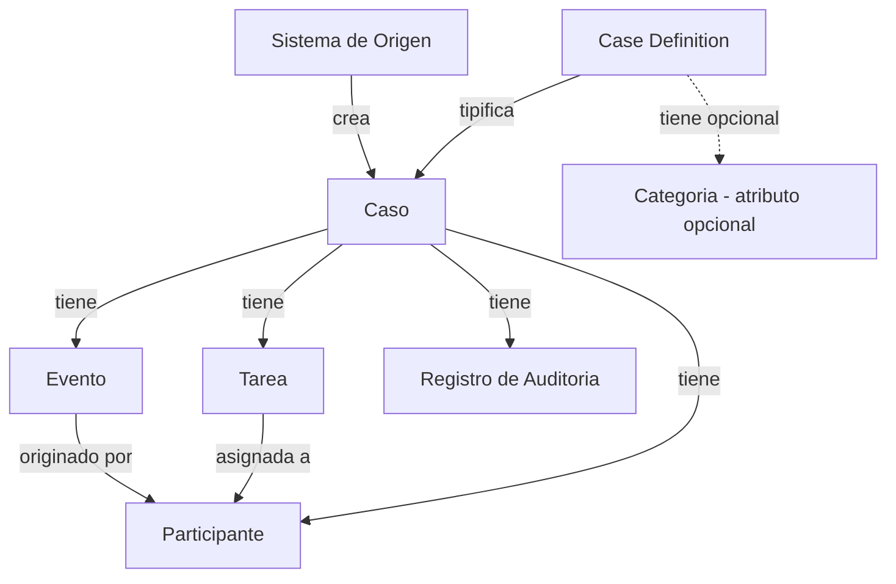
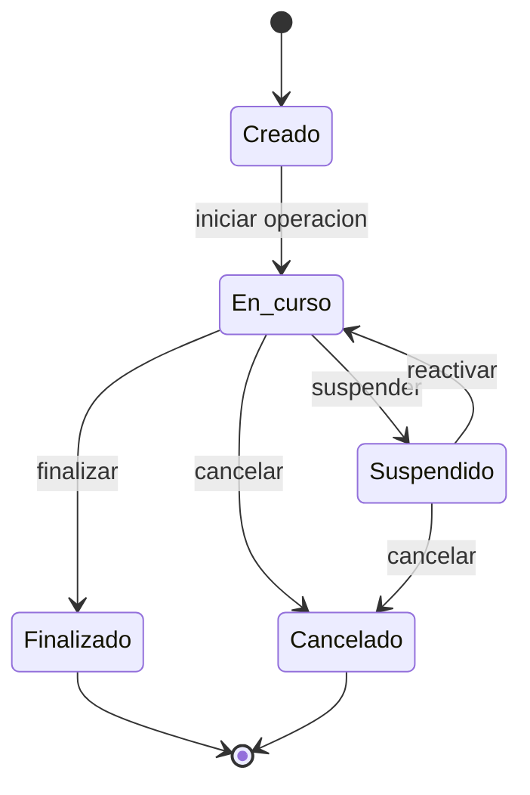

# Caimmand - Domain Model

| Campo    | Valor                |
|----------|----------------------|
| Producto | Caimmand             |
| Version  | 0.1                  |
| Estado   | Draft                |
| Fecha    | 2026-07-13           |
| Autor    | CAI Process Grid Team |

> Caimmand no ejecuta el negocio; hace visible, gobernable y operable su ejecucion.

## Tabla de contenidos

1. [Introduccion al dominio](#introduccion-al-dominio)
2. [Entidades principales](#entidades-principales)
3. [Relaciones del dominio](#relaciones-del-dominio)
4. [Timeline y Auditoria](#timeline-y-auditoria)
5. [Estados del Caso](#estados-del-caso)
6. [Participantes](#participantes)
7. [Tarea](#tarea)
8. [Ejemplo completo](#ejemplo-completo)
9. [Estado del documento](#estado-del-documento)

## Introduccion al dominio

Este documento define el modelo de dominio inicial de Caimmand, plataforma de gestion y gobernanza de procesos basados en casos. Es exclusivamente de dominio: describe conceptos, responsabilidades y relaciones, sin entrar en mecanismos de persistencia, APIs ni infraestructura tecnica.

### Que es un Caso

Un Caso es la instancia concreta de trabajo que Caimmand opera, supervisa y gobierna. Representa una unidad de trabajo real del negocio: el seguimiento de un turno medico, la resolucion de un reclamo, la ejecucion de una auditoria, el recordatorio de una cita. Cada Caso tiene identidad propia, un origen, un estado y una historia que se reconstruye a lo largo de su ciclo de vida.

### Por que el Caso es la entidad central

El Caso es el eje del producto. Todo el modelo de dominio, toda la trazabilidad y toda la operacion giran alrededor del Caso. No hay entidades operativas de primer nivel que existan fuera de un Caso: los Eventos, las Tareas, los Participantes y los Registros de Auditoria existen en relacion a un Caso concreto.

Esta decision no es accidental. Caimmand no es un BPM ni un motor de workflows: no orquesta procesos abstractos. Su valor esta en gobernar la ejecucion de instancias concretas, por lo que el Caso concentra la identidad, el estado y la historia que el producto administra.

### Relacion entre Case Definition y Caso

La separacion entre Case Definition y Caso es un pilar del modelo. Una Case Definition define que tipo de operacion se esta gobernando; un Caso es la instancia concreta que se opera en un momento determinado.

- Case Definition responde a la pregunta: "Que tipo de operacion estamos gobernando?".
- Caso responde a la pregunta: "Que instancia concreta estamos operando?".

Esta separacion permite incorporar nuevos tipos de operacion registrando una nueva Case Definition, sin alterar el nucleo del dominio: Casos, Eventos, Tareas, Participantes, Registros de Auditoria y reglas de gobierno siguen funcionando exactamente igual.

### Sistema de Origen

Los Casos siempre son creados por sistemas externos, denominados Sistemas de Origen. Caimmand nunca crea Casos: los recibe y los opera. El Sistema de Origen es el actor que invoca la creacion de un Caso asociandolo a una Case Definition previamente registrada. No se modela aqui como una entidad del dominio interno de Caimmand, pero se menciona porque su rol es indispensable para entender por que el Caso nace asociado a un origen.

## Entidades principales

### Case Definition

**Proposito**

Tipificar la operacion. Definir el tipo de Caso que se gobierna, sus valores por defecto y su presentacion. Es la entidad que permite agregar nuevos tipos de operacion sin modificar el nucleo de Caimmand.

**Responsabilidad**

- Definir el codigo funcional del tipo de operacion (ej. APPOINTMENT_REMINDER, MEDICAL_AUDIT, CLAIM).
- Proveer valores por defecto para los Casos que la referencian (SLA, prioridad, presentacion).
- Indicar si esta activa para recibir nuevos Casos.
- Agrupar opcionalmente Casos bajo una Categoria.

**Atributos principales**

| Atributo                | Descripcion                                                                 |
|-------------------------|-----------------------------------------------------------------------------|
| Codigo                  | Identificador funcional estable (ej. APPOINTMENT_REMINDER).                  |
| Nombre                  | Nombre legible (ej. "Recordatorio de Turno").                               |
| Descripcion             | Texto que describe el proposito de la operacion.                            |
| Categoria               | Agrupacion opcional (atributo opcional en el MVP).                          |
| Estado                  | Activa o inactiva. Solo las activas pueden referenciarse al crear Casos.     |
| SLA por defecto         | Tiempo maximo objetivo de resolucion, si aplica.                             |
| Prioridad por defecto   | Prioridad asignada por defecto a los Casos de esta definicion.              |
| Presentacion            | Color o icono para la interfaz de operacion.                                 |
| Estados configurables   | Conjunto de estados admisibles para los Casos de esta definicion (ver seccion 5). |

**Relaciones**

| Relacion        | Cardinalidad  | Descripcion                                                          |
|-----------------|---------------|----------------------------------------------------------------------|
| con Caso        | 1 a muchos    | Una Case Definition tipifica muchos Casos a lo largo del tiempo.      |
| con Categoria   | 0 a 1         | Una Case Definition puede pertenecer opcionalmente a una Categoria.   |

### Caso

**Proposito**

Representar la instancia concreta de trabajo que se supervisa, controla y gobierna a lo largo de su ciclo de ejecucion.

**Responsabilidad**

- Conservar la identidad del caso concreto.
- Referenciar su Case Definition.
- Mantener su estado actual dentro del ciclo de vida.
- Mantener el contexto necesario para operar el caso.
- Ser el centro alrededor del cual existen Eventos, Tareas, Participantes y Registros de Auditoria.

**Atributos principales**

| Atributo            | Descripcion                                                                |
|---------------------|----------------------------------------------------------------------------|
| Identidad           | Identificador unico del Caso dentro de Caimmand.                           |
| Case Definition     | Definicion que tipifica este Caso.                                         |
| Sistema de Origen   | Sistema externo que creo el Caso.                                          |
| Estado actual       | Estado funcional dentro del ciclo de vida del Caso.                       |
| Contexto            | Informacion relevante del Caso necesaria para su operacion.                |
| Prioridad           | Prioridad operativa (por defecto heredada de la Case Definition).          |
| SLA                 | Tiempo maximo objetivo de resolucion (por defecto heredado).               |
| Fechas relevantes    | Creacion, ultima modificacion, cierre.                                     |

**Relaciones**

| Relacion                  | Cardinalidad   | Descripcion                                                       |
|---------------------------|----------------|-------------------------------------------------------------------|
| con Case Definition       | muchos a 1     | Cada Caso pertenece a una unica Case Definition.                  |
| con Sistema de Origen     | muchos a 1     | Cada Caso fue creado por un unico Sistema de Origen.              |
| con Evento                | 1 a muchos     | Un Caso tiene multiples Eventos a lo largo de su ciclo.            |
| con Tarea                 | 1 a muchos     | Un Caso puede tener multiples Tareas.                             |
| con Participante          | muchos a muchos| Un Caso tiene multiples Participantes; un Participante puede intervenir en varios Casos. |
| con Registro de Auditoria | 1 a muchos     | Toda modificacion relevante sobre un Caso genera un Registro de Auditoria. |

### Evento

**Proposito**

Registrar un acontecimiento funcional relevante dentro del ciclo de vida de un Caso. Los Eventos componen la Timeline del Caso y son la fuente para reconstruir su historia y comprender su estado.

**Responsabilidad**

- Registrar que paso, que esta pasando y que falta en un Caso.
- Ser visible para Operadores y Supervisores en la Timeline.
- Alimentar la observabilidad y la trazabilidad funcional.

**Atributos principales**

| Atributo  | Descripcion                                                      |
|-----------|------------------------------------------------------------------|
| Identidad | Identificador unico del Evento dentro del Caso.                  |
| Caso      | Caso al que pertenece.                                           |
| Tipo      | Tipo de acontecimiento funcional (creacion, aviso, confirmacion, cancelacion, etc.). |
| Origen    | Participante o sistema que genero el Evento.                     |
| Momento   | Marca temporal de ocurrencia.                                    |
| Contenido | Informacion relevante asociada al Evento.                        |

**Relaciones**

| Relacion | Cardinalidad  | Descripcion                                       |
|----------|---------------|---------------------------------------------------|
| con Caso | muchos a 1    | Cada Evento pertenece a un unico Caso.             |
| con Participante | muchos a 1 | El Evento puede reference un Participante como origen. |

### Tarea

**Proposito**

Representar una accion pendiente asociada a un Caso. Una Tarea es work concrete que alguien (persona, automatizacion o agente IA) debe realizar para avanzar la operacion del Caso.

**Responsabilidad**

- Indicar que trabajo concreto falta realizar sobre un Caso.
- Registrar a quien esta asignada.
- Registrar su estado (pendiente, en curso, completada, cancelada).
- Registrar el resultado al cerrarse.

**Atributos principales**

| Atributo              | Descripcion                                                                 |
|-----------------------|-----------------------------------------------------------------------------|
| Identidad             | Identificador unico de la Tarea dentro del Caso.                             |
| Caso                  | Caso al que pertenece.                                                       |
| Tipo                  | Tipo de accion a realizar (ej. enviar_sms, confirmar_turno, reprogramar).   |
| Participante asignado | Persona, automatizacion o agente responsable de ejecutarla.                 |
| Estado                | Estado funcional de la Tarea.                                                |
| Resultado             | Informacion producida al ejecutarla.                                         |
| Fechas relevantes     | Creacion, asignacion, cierre.                                                |

**Relaciones**

| Relacion        | Cardinalidad  | Descripcion                                                       |
|-----------------|---------------|-------------------------------------------------------------------|
| con Caso        | muchos a 1    | Cada Tarea pertenece a un unico Caso.                             |
| con Participante| muchos a 1    | La Tarea puede estar asignada a un Participante.                  |

### Participante

**Proposito**

Modelar a cualquier actor que interviene en un Caso, sea una persona, una automatizacion, un sistema externo o un agente IA. El Participante es la entidad que unifica los actores del dominio sin importar su naturaleza.

**Responsabilidad**

- Identificar univocamente a quien interviene en un Caso.
- Indicar el tipo de actor (persona externa, usuario interno, sistema externo, agente IA).
- Indicar el rol que cumple dentro del Caso (paciente, operador, supervisor, sistema de turnos, agente de recordatorio, etc.).

**Atributos principales**

| Atributo  | Descripcion                                                                 |
|-----------|-----------------------------------------------------------------------------|
| Identidad | Identificador del Participante.                                              |
| Tipo      | Persona externa, usuario interno, sistema externo, agente IA.               |
| Rol       | Funcion que cumple dentro del Caso.                                         |
| Referencia| Identificador o nombre descriptivo externo (ej. paciente Juan Perez, sistema de turnos). |

**Relaciones**

| Relacion        | Cardinalidad   | Descripcion                                                          |
|-----------------|----------------|----------------------------------------------------------------------|
| con Caso        | muchos a muchos| Un Participante puede intervenir en multiples Casos en distintos roles. |
| con Tarea       | muchos a 1     | Un Participante puede estar asignado a multiples Tareas.              |
| con Evento      | muchos a 1     | Un Participante puede ser origen de multiples Eventos.                |

### Registro de Auditoria

**Proposito**

Registrar Tecnico de los cambios, accesos y operaciones realizados sobre el dominio. A diferencia de los Eventos, los Registros de Auditoria no son funcionales ni visibles para el flujo operativo: existe para garantizar trazabilidad tecnica, cumplimiento y reconstruccion forense del sistema.

**Responsabilidad**

- Registrar quien realizo una operacion.
- Registrar cuando se realizo.
- Registrar que cambio exacto se produjo (estado anterior, estado posterior, atributos modificados).
- Registrar el origen de la operacion (usuario, sistema externo, automatizacion, agente IA).
- Mantenerse inmutable: un Registro de Auditoria no se modifica ni se elimina.

**Atributos principales**

| Atributo        | Descripcion                                                              |
|-----------------|--------------------------------------------------------------------------|
| Identidad       | Identificador unico del Registro de Auditoria.                           |
| Caso            | Caso al que pertenece.                                                   |
| Operacion       | Tipo de operacion realizada (creacion, cambio de estado, modificacion, acceso, etc.). |
| Origen          | Actor que ejecuto la operacion (usuario, sistema, automatizacion).       |
| Momento         | Marca temporal precisa de la operacion.                                  |
| Cambio          | Detalle tecnico del cambio (estado anterior, estado posterior, campos modificados). |
| Contexto tecnico| Informacion de contexto (origen de la solicitud, referencia externa, etc.). |

**Relaciones**

| Relacion             | Cardinalidad  | Descripcion                                                    |
|----------------------|---------------|----------------------------------------------------------------|
| con Caso             | muchos a 1    | Cada Registro de Auditoria pertenece a un unico Caso.          |
| con otras entidades  | muchos a 1    | Un Registro puede referenciar la entidad concreta modificada.  |

## Relaciones del dominio

El siguiente diagrama muestra la jerarquia de relaciones del dominio. La Case Definition define el tipo de operacion; el Caso es la instancia concreta; bajo el Caso se agrupan los Eventos, las Tareas, los Participantes y los Registros de Auditoria. La Categoria se muestra como atributo opcional de la Case Definition.

### Lectura del diagrama

- La Case Definition tipifica al Caso; un Sistema de Origen crea el Caso referenciando la Case Definition.
- La Categoria es un atributo opcional de la Case Definition, no una entidad separada en el MVP.
- El Caso agrupa Eventos, Tareas, Participantes y Registros de Auditoria.
- Las Tareas pueden estar asignadas a Participantes.
- Los Eventos pueden tener un Participante como origen.

## Timeline y Auditoria

Caimmand distingue dos conceptos que en otros sistemas suelen confundirse: la Timeline (funcional, visible) y la Auditoria (tecnica, inmutable). Su separacion es una decision de dominio, no de implementacion.

### Timeline

La Timeline es la cronologia funcional de un Caso, compuesta por Eventos visibles. Responde a las preguntas operativas:

- Que esta pasando?
- Que paso?
- Que falta?
- Tengo que hacer algo?

La Timeline es la herramienta principal del Operador y del Supervisor para comprender el estado de un Caso en menos de diez segundos.

### Auditoria

La Auditoria es el registro tecnico e inmutable de los cambios, accesos y operaciones realizados sobre el dominio. Responde a preguntas de cumplimiento y reconstruccion forense:

- Quien realizo la operacion?
- Cuando se realizo?
- Que cambio exacto se produjo?
- Desde donde se ejecuto?

### Tabla comparativa

| Dimension           | Timeline (Eventos)                                    | Auditoria (Registros de Auditoria)                          |
|---------------------|-------------------------------------------------------|-------------------------------------------------------------|
| Naturaleza          | Funcional                                             | Tecnica                                                      |
| Visibilidad         | Visible para Operadores y Supervisores                | Disponible para Gerentes y cumplimiento                     |
| Eventos registrados | Acontecimientos funcionales (creacion, aviso, confirmacion, cancelacion) | Cambios de estado, accesos, modificaciones, operaciones   |
| Mutabilidad         | Los Eventos no se modifican, pero la Timeline crece   | Los Registros son estrictamente inmutables                  |
| Audiencia           | Operacion diaria                                      | Gobierno, auditoria, cumplimiento                           |
| Proposito           | Comprender el caso y que falta por hacer              | Reconstruir quien hizo que cambio y cuando                  |
| Granularidad        | Orientada al usuario                                   | Orientada al sistema                                         |

## Estados del Caso

El ciclo de vida del Caso describe los estados por los que un Caso puede transitar durante su operacion en Caimmand. Para el MVP se proponen los siguientes estados base, consistentes con lo definido en el documento de arquitectura.

### Estados base del MVP

| Estado     | Descripcion                                                          |
|------------|---------------------------------------------------------------------|
| Creado     | El Caso fue registrado en Caimmand por un Sistema de Origen.        |
| En curso   | El Caso esta siendo operado: existen tareas activas o en ejecucion. |
| Suspendido | El Caso fue pausado manualmente o por una regla de gobierno.        |
| Finalizado | El Caso completo su ciclo de ejecucion con exito.                    |
| Cancelado  | El Caso fue interrumpido sin completar su ciclo.                    |

### Diagrama de transiciones

### Estados configurables por Case Definition

Los estados base son el punto de partida del MVP, pero no son una camisa de fuerza. Cada Case Definition puede definir su propio conjunto admisible de estados y las transiciones validas, siempre que respete la existencia de al menos un estado inicial, uno o varios estados terminales y la inmutabilidad de los estados terminales.

Una Case Definition puede, por ejemplo, anadir estados intermedios adicionales como `En revision`, `Escalado` o `Bloqueado`, sin que esto afecte al nucleo del dominio. Las reglas de transicionentre estados viven en Caimmand, nunca en los workflows externos.

### Reglas comunes

- No existen transiciones desde los estados terminales `Finalizado` ni `Cancelado`.
- Toda transicion genera un Evento en la Timeline del Caso.
- Toda transicion genera un Registro de Auditoria asociado al Caso.
- Las transiciones se rigen por las reglas de gobierno definidas en Caimmand, no por la logica de los workflows externos.

## Participantes

Un Participante es cualquier actor que interviene en un Caso, sin importar su naturaleza. El modelo unifica en una sola entidad a personas externas, usuarios internos, sistemas externos y agentes de IA, evitando fragmentar el dominio segun el tipo de actor.

### Tipos de Participante

| Tipo               | Descripcion                                                                                     | Ejemplo                                                          |
|--------------------|-------------------------------------------------------------------------------------------------|------------------------------------------------------------------|
| Persona externa    | Individuo que es objeto del Caso pero no es usuario de Caimmand.                              | Paciente, cliente, beneficiario, ciudadano.                      |
| Usuario interno    | Persona que opera dentro de Caimmand con un rol operativo.                                     | Operador, Supervisor, Gerente.                                   |
| Sistema externo    | Aplicacion o servicio que interactua con Caimmand para crear Casos o registrar avances.        | Sistema de turnos, CRM, sistema de reclamos, n8n.                 |
| Agente IA          | Agente automatizado basado en inteligencia artificial que ejecuta trabajo sobre un Caso.       | Agente de recordatorio, agente de clasificacion, agente de resumen. |

### Distincion clave

El tipo de Participante describe la naturaleza del actor; el rol describe la funcion que cumple dentro del Caso concreto. Un mismo Participante puede cumplir distintos roles en distintos Casos. Por ejemplo, un Supervisor puede ser `supervisor` en un Caso y `escalado` en otro.

## Tarea

La Tarea es una entidad deliberadamente acotada. Representa una accion pendiente asociada a un Caso, pero no es un motor BPM.

### Que es una Tarea

- Una accion concreta, pendiente o realizada, vinculada a un Caso.
- Una unidad de trabajo que alguien debe ejecutar.
- Un puntero a trabajo pendiente, con estado, asignatario y resultado.

### Que no es una Tarea

- No es un nodo de un workflow.
- No contiene logica de flujo.
- No decide cual es la siguiente Tarea.
- No ejecuta procesos de negocio.
- No orquesta automatizaciones.

### Aclaracion arquitectural

La ejecucion real del trabajo (enviar un SMS, consultar un sistema, generar un documento, ejecutar un agente IA) ocurre fuera de Caimmand. Lo que queda en Caimmand es el registro de la Tarea, su asignatario, su estado y su resultado. Caimmand no ejecuta tareas; las gobierna.

Esta decision protege al producto de convertirse en un BPM. Los procesos complejos y automatizaciones son responsabilidad de otros componentes del ecosistema (como CaiFlow) o de herramientas externas (como n8n). Caimmand mantiene el Caso, su estado, su Timeline y sus Registros de Auditoria; los workflows externos ejecutan las Tareas y reportan el avance a Caimmand.

## Ejemplo completo

Para ilustrar el modelo de dominio, se construye un ejemplo completo con el tipo de operacion mas representativo de Caimmand: el recordatorio de un turno medico.

### Case Definition

| Atributo                | Valor                                                 |
|-------------------------|-------------------------------------------------------|
| Codigo                  | APPOINTMENT_REMINDER                                  |
| Nombre                  | Recordatorio de Turno                                 |
| Descripcion             | Operacion que recorda al paciente su turno medico y registra el resultado. |
| Categoria               | Atencion al paciente                                  |
| Estado                  | Activa                                                |
| SLA por defecto         | 48 horas                                              |
| Prioridad por defecto   | Media                                                 |
| Presentacion            | Icono de calendario, color azul.                      |
| Estados configurables   | Creado, En curso, Finalizado, Cancelado               |

### Caso generado

| Atributo            | Valor                                                                                  |
|---------------------|----------------------------------------------------------------------------------------|
| Identidad           | Caso #2026-000154                                                                      |
| Case Definition     | APPOINTMENT_REMINDER ("Recordatorio de Turno")                                          |
| Sistema de Origen   | Sistema de Turnos Medicos                                                              |
| Estado actual       | En curso                                                                                |
| Contexto            | Paciente Juan Perez, turno el 18/07 a las 10:30, medico Dra. Lopez, consultorio 4.     |
| Prioridad           | Media                                                                                   |
| SLA                 | 48 horas desde creacion                                                                |
| Fechas relevantes   | Creado: 16/07/2026 08:00.                                                              |

### Participantes

| Participante                | Tipo             | Rol                      |
|------------------------------|------------------|--------------------------|
| Juan Perez (paciente)         | Persona externa | Paciente                  |
| Maria Gonzalez (operadora)    | Usuario interno | Operador                  |
| Sistema de Turnos Medicos     | Sistema externo | Sistema de Origen         |
| Agente de Recordatorio SMS    | Agente IA       | Agente ejecutor de SMS    |

### Timeline (Eventos)

| Momento                | Tipo        | Origen                  | Contenido                                                         |
|------------------------|-------------|-------------------------|-------------------------------------------------------------------|
| 16/07/2026 08:00       | Creacion    | Sistema de Turnos       | Caso creado para el turno de Juan Perez del 18/07 a las 10:30.    |
| 16/07/2026 08:05       | Asignacion  | Caimmand                 | Tarea "enviar_sms" asignada al Agente de Recordatorio SMS.        |
| 16/07/2026 08:06       | Aviso       | Agente de Recordatorio  | SMS enviado al paciente.                                          |
| 17/07/2026 10:00       | recordatorio| Agente de Recordatorio  | Segundo SMS enviado al paciente.                                 |
| 18/07/2026 09:30       | Confirmacion| Paciente                 | Paciente confirma asistencia via respuesta al SMS.               |

### Tareas

| Tarea                  | Asignatario                  | Estado     | Resultado                                   |
|------------------------|------------------------------|------------|---------------------------------------------|
| Enviar SMS inicial      | Agente de Recordatorio SMS   | Completada | SMS enviado correctamente.                  |
| Enviar SMS de seguimiento | Agente de Recordatorio SMS | Completada | SMS enviado correctamente.                  |
| Confirmar asistencia    | Operadora Maria Gonzalez     | En curso   | Pendiente de validacion de respuesta.       |
| Registrar outcome al Sistema de Turnos | Operadora Maria Gonzalez | Pendiente | -                                          |

### Registro de Auditoria (extracto)

| Momento               | Operacion                | Origen                    | Cambio                                                 |
|------------------------|--------------------------|---------------------------|--------------------------------------------------------|
| 16/07/2026 08:00       | Creacion de Caso         | Sistema de Turnos         | Caso creado con estado Creado.                         |
| 16/07/2026 08:05       | Cambio de estado         | Caimmand                  | Estado: Creado -> En curso.                            |
| 16/07/2026 08:06       | Registro de Evento      | Agente de Recordatorio    | Evento "Aviso" agregado a Timeline.                    |
| 18/07/2026 09:30       | Registro de Evento      | Paciente                  | Evento "Confirmacion" agregado a Timeline.             |
| 18/07/2026 09:31       | Cambio de estado de Tarea | Operadora Maria Gonzalez  | Tarea "Confirmar asistencia": En curso -> Completada. |

### Lectura del ejemplo

- La Case Definition define el tipo de operacion con valores por defecto.
- El Sistema de Turnos crea el Caso referenciando la Case Definition.
- Los Participantes incluyen al paciente, a la operadora, al sistema de turnos y al agente IA.
- La Timeline muestra la historia funcional visible del Caso.
- Las Tareas indican el trabajo pendiente y realizado, sin ejecutar trabajo: el envio del SMS lo realiza el agente IA fuera de Caimmand.
- Los Registros de Auditoria registran la trazabilidad tecnica de cambios y operaciones.

## Estado del documento

Este documento se encuentra en estado **Draft**, version **0.1**.

El contenido refleja el modelo de dominio inicial del producto Caimmand para el MVP. Los estados del Caso, la definicion de las entidades y la separacion entre Timeline y Auditoria son coherentes con el PDD y el documento de arquitectura. El modelo podra ampliarse en futuras iteraciones a medida que se consoliden nuevos requerimientos funcionales.

Pendiente de revision por el equipo CAI Process Grid.