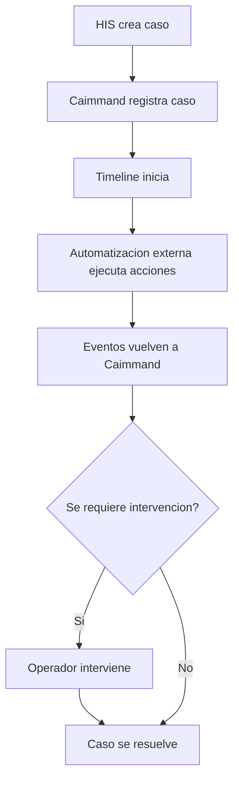
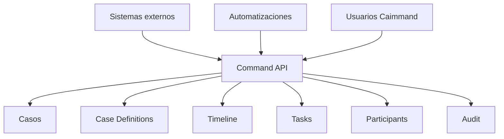

# Caimmand - MVP

| Campo    | Valor                |
|----------|----------------------|
| Producto | Caimmand             |
| Version  | 0.1                  |
| Estado   | Draft                |
| Fecha    | 2026-07-13           |
| Autor    | CAI Process Grid Team |

> Caimmand no ejecuta el negocio; hace visible, gobernable y operable su ejecucion.

## Tabla de contenidos

1. [Introduccion](#introduccion)
2. [Objetivos del MVP](#objetivos-del-mvp)
3. [Alcance funcional](#alcance-funcional)
4. [Caso de uso principal del MVP](#caso-de-uso-principal-del-mvp)
5. [Fuera de alcance del MVP](#fuera-de-alcance-del-mvp)
6. [Roles y permisos MVP](#roles-y-permisos-mvp)
7. [Arquitectura funcional MVP](#arquitectura-funcional-mvp)
8. [Evolucion futura](#evolucion-futura)
9. [Criterios de exito del MVP](#criterios-de-exito-del-mvp)
10. [Estado del documento](#estado-del-documento)

## Introduccion

Este documento define la primera version funcional de Caimmand, el MVP. Su proposito es acotar que problema resuelve, que capacidades incluye, que queda fuera del alcance y cuales son las funcionalidades prioritarias para la primera entrega del producto.

Caimmand es una plataforma de gestion y gobernanza de procesos basados en casos, perteneciente al ecosistema CAI Process Grid. No es un BPM, no es un motor de workflows y no es un disenador de procesos. La automatizacion y la orquestacion compleja pertenecen a otros componentes del ecosistema o a herramientas externas. Caimmand administra el ciclo de vida, la trazabilidad, la interaccion humana y la gobernanza del caso.

### Objetivo del MVP

El objetivo del MVP es validar el proposito fundamental del producto: proveer un punto unico desde el cual las organizaciones operen, supervisen, gobiernen y auditen la ejecucion de casos creados por sistemas externos, con trazabilidad completa y visibilidad operativa en tiempo real.

### Vision del producto

Caimmand es la plataforma de operaciones y gobierno donde las organizaciones supervisan, controlan e intervienen en la ejecucion de casos impulsados por inteligencia artificial y automatizaciones. Su valor esta en hacer visible, gobernable y operable la ejecucion del negocio, sin ejecutar el negocio.

### Principio fundamental

El Caso es la unidad central de gestion, trazabilidad y gobernanza. Todo el modelo, toda la operacion y toda la historia del producto giran alrededor del Caso. No hay entidad operativa de primer nivel que exista fuera de un Caso.

## Objetivos del MVP

Los objetivos del MVP son medibles y estan orientados a validar la propuesta de valor del producto en un escenario real.

| Objetivo | Descripcion | Indicador de exito |
|----------|-------------|---------------------|
| Creacion de casos | Permitir que sistemas externos creen casos asociados a Case Definitions activas. | Casos creados correctamente desde sistemas origen. |
| Gestion operativa | Permitir a operadores gestionar casos asignados y completar tareas. | Tareas completadas por operadores. |
| Trazabilidad | Mantener historial completo de eventos funcionales y registro tecnico de auditoria. | Trazabilidad completa por caso. |
| Supervision | Permitir a supervisores visualizar el estado de los casos, reasignar y escalar. | Casos reasignados y escalados. |
| Auditoria | Permitir reconstruir el ciclo completo de un caso, cambio por cambio. | Auditoria completa y inmutable por caso. |
| Gobernanza | Permitir al Gerente administrar Case Definitions y usuarios. | Case Definitions activas configuradas. |

## Alcance funcional

El alcance del MVP cubre las capacidades minimas necesarias para gobernar el ciclo de vida de un caso de extremo a extremo, desde su creacion por un sistema externo hasta su resolucion, con trazabilidad y auditoria completas.

### Case Management

Gestion del Caso, la entidad operativa central. Los casos son creados por sistemas externos y administrados por Caimmand a lo largo de su ciclo de vida.

| Capacidad | Descripcion |
|-----------|-------------|
| Creacion de casos | Sistemas externos crean casos via Command API, asociandolos a una Case Definition activa. |
| Consulta de casos | Operadores, supervisores y gerentes consultan el detalle de un caso (estado, contexto, participantes, timeline, tareas). |
| Listado y busqueda | Listado de casos con filtros basicos: estado, Case Definition, sistema de origen, participante asignado. |
| Visualizacion del detalle | Vista consolidada del caso: estado actual, contexto, participantes, timeline cronologica y tareas. |
| Cambio de estado | Transicion del estado del caso segun las reglas de gobierno y el conjunto de estados admisibles para su Case Definition. |
| Asignacion de responsables | Asignacion de casos y tareas a participantes con rol operativo. |

Comprension del estado de un caso en menos de diez segundos, respondiendo: que esta pasando, que paso, que falta y si se requiere accion.

### Case Definition

Tipificacion de los casos. La Case Definition define que tipo de operacion se gobierna y aporta valores por defecto y presentacion a los casos que la referencian.

| Capacidad | Descripcion |
|-----------|-------------|
| Definicion de tipos de casos | Registro de Case Definitions con codigo, nombre, descripcion y categoria. |
| Configuracion basica | SLA por defecto, prioridad por defecto, presentacion (color o icono) y estados admisibles. |
| Activacion e inactivacion | Solo las Case Definitions activas pueden referenciarse al crear casos. |
| Consulta | Disponible para operadores, supervisores, gerentes y automatizaciones que necesitan conocer el tipo de operacion. |

La Case Definition esta preparada para evolucionar en versiones futuras hacia plantillas, reglas por definicion y versionado, pero el MVP se limita a la configuracion basica descrita.

### Timeline

Registro y visualizacion cronologica de los eventos funcionales del caso. La Timeline es la herramienta principal del operador y del supervisor para comprender la historia y el estado de un caso.

| Capacidad | Descripcion |
|-----------|-------------|
| Registro de eventos | Todo acontecimiento funcional relevante genera un evento en la Timeline del caso. |
| Visualizacion cronologica | La Timeline se presenta en orden cronologico, permitiendo reconstruir la historia del caso. |
| Trazabilidad del caso | La Timeline permite responder: que paso, que esta pasando, que falta y si se requiere accion. |

### Distincion Timeline vs Audit

El MVP distingue dos conceptos que no deben confundirse: la Timeline (funcional, visible) y la Auditoria (tecnica, inmutable).

| Dimension | Timeline (Eventos funcionales) | Audit (Registro tecnico) |
|-----------|--------------------------------|--------------------------|
| Naturaleza | Funcional | Tecnica |
| Eventos registrados | Acontecimientos funcionales: creacion, aviso, confirmacion, cancelacion. | Cambios de estado, accesos, modificaciones, operaciones. |
| Visibilidad | Visible para operadores y supervisores en la operacion diaria. | Disponible para gerentes y cumplimiento. |
| Mutabilidad | Los eventos no se modifican, pero la Timeline crece. | Los registros son estrictamente inmutables. |
| Proposito | Comprender el caso y que falta por hacer. | Reconstruir quien hizo que cambio y cuando. |

### Tasks

Registro de acciones pendientes asociadas a un caso. La Task representa trabajo concreto que alguien debe realizar, pero no es un nodo de workflow ni contiene logica de flujo.

| Capacidad | Descripcion |
|-----------|-------------|
| Creacion de tareas | Creacion de tareas asociadas a un caso, con tipo, participante asignado y estado. |
| Asignacion | Asignacion de una tarea a un participante (persona, automatizacion o agente IA). |
| Estados | Cuatro estados admisibles: pendiente, en progreso, completada, cancelada. |
| Resultado | Registro del resultado al cerrar una tarea completada. |

Aclaracion: Task NO representa un workflow BPM. Caimmand no ejecuta tareas ni orquesta su secuencia. La ejecucion real del trabajo ocurre fuera de Caimmand; lo que queda en Caimmand es el registro de la tarea, su estado, su asignatario y su resultado.

### Participants

Modelado de los actores que intervienen en un caso, sin importar su naturaleza. El Participante unifica en una sola entidad a personas externas, usuarios internos, sistemas externos y agentes IA.

| Tipo | Descripcion | Ejemplo |
|------|-------------|---------|
| Persona externa | Individuo objeto del caso, no usuario de Caimmand. | Paciente, cliente, beneficiario. |
| Usuario interno | Persona que opera dentro de Caimmand con un rol operativo. | Operador, Supervisor, Gerente. |
| Sistema externo | Aplicacion o servicio que interactua con Caimmand. | HIS, CRM, sistema de reclamos. |
| Agente IA | Agente automatizado basado en inteligencia artificial. | Agente de recordatorio, agente de clasificacion. |

### Integrations

Integracion con sistemas externos para la creacion de casos y el registro de eventos. Toda interaccion externa se canaliza a traves de la Command API: no se permite acceso directo a la persistencia.

| Capacidad | Descripcion |
|-----------|-------------|
| API para creacion de casos | Sistemas externos crean casos via Command API, referenciando una Case Definition activa. |
| Autenticacion de sistemas externos | Identificacion y autenticacion de los sistemas externos autorizados a crear casos. |
| Recepcion de eventos | Registro de eventos y tareas sobre los casos existentes, canalizado via Command API. |

### Security

Modelo de roles inicial para el MVP. Tres roles operativos cubren la gestion, la supervision y la administracion del producto.

| Rol | Funcion principal |
|-----|-------------------|
| Operador | Gestionar casos asignados, completar tareas, agregar informacion. |
| Supervisor | Visualizar el equipo, reasignar casos, supervisar estados. |
| Gerente | Configurar definiciones, gestionar usuarios, gobernar la operacion global. |

El detalle de permisos por rol se describe en la seccion 6.

## Caso de uso principal del MVP

El primer caso real del MVP es el "Recordatorio de turnos medicos". Este caso de uso valida la propuesta de valor de Caimmand en un escenario operativo concreto, con un sistema origen real, automatizacion externa e intervencion humana.

### Contexto

| Elemento | Descripcion |
|----------|-------------|
| Sistema origen | HIS (Hospital Information System). |
| Case Definition | APPOINTMENT_REMINDER ("Recordatorio de Turno"). |
| Participantes | Paciente, operador, sistema HIS, agente IA de recordatorio. |
| Objetivo | Recordar al paciente su turno medico y registrar el resultado. |

### Flujo

### Lectura del flujo

1. El HIS crea un caso en Caimmand via Command API, referenciando la Case Definition APPOINTMENT_REMINDER.
2. Caimmand registra el caso con estado inicial y arranca la Timeline con el evento de creacion.
3. Una automatizacion externa (fuera de Caimmand) ejecuta las acciones concretas: enviar SMS, reintentar, escuchar respuesta.
4. Cada accion relevante genera un evento que vuelve a Caimmand via Command API y alimenta la Timeline.
5. Si se requiere intervencion humana (confirmacion, reprogramacion, escalado), el operador actua sobre el caso desde Caimmand.
6. El caso se resuelve y transita a un estado terminal (Finalizado o Cancelado).

### Separacion con la automatizacion

Caimmand no ejecuta el envio del SMS, no decide la cantidad de reintentos y no gestiona la conexion con el sistema de mensajeria. Esa logica vive en la automatizacion externa (como n8n o un orquestador del ecosistema). Caimmand mantiene el caso, su estado, su Timeline y sus Registros de Auditoria; la automatizacion externa reporta el avance a Caimmand.

## Fuera de alcance del MVP

El MVP se concentra deliberadamente en la gestion, trazabilidad y gobernanza del caso. Las siguientes capacidades quedan fuera del alcance de la primera version.

| Capacidad | Razon |
|-----------|-------|
| Disenador visual de procesos | Caimmand no disena procesos; los opera. El diseno pertenece a herramientas externas de modelado. |
| Motor BPM | Caimmand no ejecuta procesos de negocio ni workflows. La ejecucion vive fuera. |
| Ejecucion automatica compleja | La orquestacion compleja pertenece a otros componentes del ecosistema o a herramientas externas. |
| Reglas avanzadas | El MVP incluye reglas basicas de transicion y gobierno. Reglas sofisticadas y parametrizables por organizacion quedan para iteraciones futuras. |
| IA autonoma tomando decisiones criticas | La IA ejecuta; las personas supervisan y deciden. El MVP no incorpora IA autonoma que tome decisiones criticas sin supervision. |
| Marketplace de agentes | No existe en el MVP. La gestion de agentes externos es responsabilidad de plataformas externas. |
| Analitica avanzada | El MVP incluye observabilidad basica. La analitica avanzada, tableros y reportes complejos quedan para futuras iteraciones. |

## Roles y permisos MVP

El MVP define tres roles operativos. El rol describe la funcion dentro del producto; el permiso describe que capacidades estan habilitadas para cada rol.

### Operador

| Capacidad | Descripcion |
|-----------|-------------|
| Gestionar casos asignados | Consultar, actualizar contexto y avanzar el estado de los casos que tiene asignados. |
| Completar tareas | Iniciar, completar y cancelar tareas asignadas a su persona. |
| Agregar informacion | Registrar eventos funcionales y participaciones sobre los casos asignados. |

### Supervisor

| Capacidad | Descripcion |
|-----------|-------------|
| Visualizar el equipo | Ver el conjunto de casos asignados a cada operador del equipo. |
| Reasignar casos | Reasignar casos y tareas entre operadores para balancear la carga. |
| Supervisar estados | Consultar el estado de todos los casos, suspender, reactivar y escalar. |

### Gerente

| Capacidad | Descripcion |
|-----------|-------------|
| Configurar definiciones | Crear, actualizar, activar y desactivar Case Definitions. |
| Gestionar usuarios | Administrar los usuarios internos y sus roles. |
| Gobernar la operacion global | Auditar, analizar tendencias y tomar decisiones de alto nivel sobre el conjunto de casos. |

## Arquitectura funcional MVP

La arquitectura funcional del MVP refleja la separacion entre la ejecucion del negocio (externa) y la gestion y gobernanza del caso (interna). Toda interaccion externa se canaliza a traves de la Command API.

### Lectura del diagrama

- Sistemas externos, automatizaciones y usuarios interactuan con Caimmand exclusivamente a traves de la Command API.
- La Command API canaliza las operaciones hacia las entidades del dominio: Casos, Case Definitions, Timeline, Tasks, Participants y Audit.
- No se permite acceso directo a la persistencia por parte de ningun cliente, externo o interno.
- Las reglas de negocio que validan cada operacion viven dentro de Caimmand, no en los clientes.

## Evolucion futura

El MVP es la base sobre la que el producto crecera. Las siguientes capacidades quedan fuera del alcance inicial pero estan previstas en la hoja de ruta del producto. Su inclusion no compromete la arquitectura del MVP y se incorporaran en futuras iteraciones.

### Capacidades futuras

| Capacidad | Descripcion funcional |
|-----------|------------------------|
| Integracion con nucleo de datos del ecosistema | Conexion profunda con un nucleo de datos compartido del ecosistema CAI Process Grid para enriquecer el contexto del caso. |
| Agentes IA especializados | Agentes especializados por tipo de operacion que ejecuten trabajo sobre los casos bajo supervision humana. |
| Analitica avanzada | Capacidad analitica avanzada sobre el historial de casos: tableros, tendencias, metricas y reportes. |
| Automatizacion mediante orquestador | Automatizacion y orquestacion compleja mediante un orquestador del ecosistema, manteniendo la separacion entre ejecucion y gobierno. |
| Memoria empresarial institucional | Memoria institucional que conserve el conocimiento generado por la operacion de casos a lo largo del tiempo. |

El MVP no anticipa componentes especificos futuros. Las capacidades se describen a nivel funcional y se materializaran en su momento segun las decisiones que se documenten en las iteraciones correspondientes.

## Criterios de exito del MVP

El exito del MVP se mide por indicadores concretos orientados a producto y operacion.

| Indicador | Descripcion |
|-----------|-------------|
| Casos creados correctamente | Porcentaje de casos creados desde sistemas origen que se registran sin error y referencian una Case Definition activa. |
| Tiempo de resolucion | Tiempo medio entre la creacion del caso y su transicion a estado terminal (Finalizado o Cancelado). |
| Trazabilidad completa | Porcentaje de casos cuya Timeline y Registro de Auditoria permiten reconstruir el ciclo completo sin gaps. |
| Adopcion por operadores | Porcentaje de operadores que completan tareas y registran eventos sobre los casos asignados. |
| Integracion exitosa con sistemas origen | Numero de sistemas origen integrados y operando en produccion. |

## Estado del documento

Este documento se encuentra en estado **Draft**, version **0.1**.

El contenido define el alcance funcional del MVP de Caimmand y es coherente con el PDD, el documento de arquitectura y el modelo de dominio. Los roles, estados del Caso, definicion de entidades y separaciones conceptuales (Timeline vs Audit, Task vs workflow BPM, Caimmand vs ejecucion externa) siguen las decisiones tomadas en los documentos de referencia.

Pendiente de revision por el equipo CAI Process Grid.