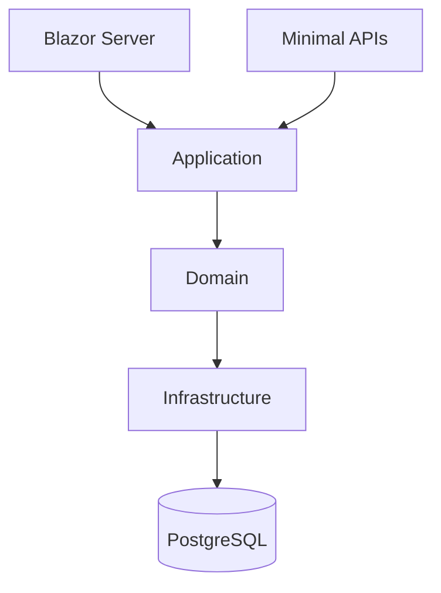
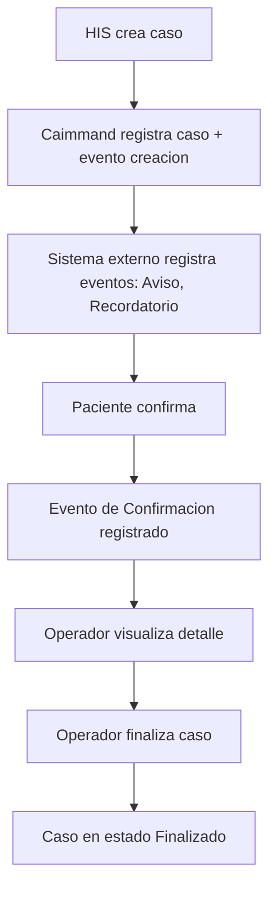

# Caimmand - PoC Implementation Plan

| Campo    | Valor                |
|----------|----------------------|
| Producto | Caimmand             |
| Version  | 0.1                  |
| Estado   | Draft                |
| Fecha    | 2026-07-13           |
| Autor    | CAI Process Grid Team |

> Caimmand no ejecuta el negocio; hace visible, gobernable y operable su ejecucion.

## Tabla de contenidos

1. [Introduccion](#introduccion)
2. [Objetivos](#objetivos)
3. [Alcance](#alcance)
4. [Arquitectura del PoC](#arquitectura-del-poc)
5. [Estructura de la solucion](#estructura-de-la-solucion)
6. [Organizacion interna](#organizacion-interna)
7. [Modelo de datos inicial](#modelo-de-datos-inicial)
8. [API minima](#api-minima)
9. [Pantallas del PoC](#pantallas-del-poc)
10. [Flujo funcional](#flujo-funcional)
11. [Roadmap de implementacion](#roadmap-de-implementacion)
12. [Tecnologias](#tecnologias)
13. [Decisiones tecnicas](#decisiones-tecnicas)
14. [Fuera de alcance](#fuera-de-alcance)
15. [Criterios de exito](#criterios-de-exito)
16. [Estado del documento](#estado-del-documento)

## Introduccion

Este documento es el plan tecnico que utilizara el equipo para construir el primer Proof of Concept (PoC) de Caimmand. No es un documento de arquitectura, no es un ADR y no es documentacion funcional: es la guia diaria de implementacion.

### Proposito del PoC

El objetivo del PoC es demostrar que Caimmand puede operar un proceso basado en casos de extremo a extremo. El proceso seleccionado es "Recordatorio de Turnos Medicos", coherente con el caso de uso principal definido en el MVP. El PoC valida que el producto puede crear un caso, gestionarlo, registrar su timeline, cambiar su estado y ofrecer al operador una experiencia de visualizacion y trazabilidad.

### No es una version enterprise

El PoC no pretende validar escalabilidad, alta disponibilidad, multi tenancy, seguridad enterprise, rendimiento, clustering ni arquitectura distribuida. Su proposito es validar el producto. Siempre prioriza simplicidad sobre completitud. No intenta resolver problemas futuros: las capacidades transversales (observabilidad, autenticacion, integraciones reales, multi tenant) quedan fuera del alcance y se tratan en iteraciones posteriores.

### Alineacion con documentacion existente

Este plan respeta las decisiones tomadas en el PDD, el documento de arquitectura, el ADR-001 (Modular Monolith), el DomainModel y el MVP. No agrega funcionalidades no definidas, no contradice el dominio y opera dentro de los limites establecidos por la arquitectura funcional.

## Objetivos

El PoC debe poder:

| Objetivo | Descripcion |
|----------|-------------|
| Crear un caso | Recibir la creacion de un caso desde un sistema externo via API. |
| Consultar casos | Listar casos con filtros basicos y consultar el detalle de un caso. |
| Visualizar el detalle | Mostrar estado, contexto y timeline de un caso en una sola vista. |
| Registrar eventos | Anadir eventos funcionales a la timeline de un caso existente. |
| Cambiar estado | Transitar el estado del caso entre los estados admisibles. |
| Visualizar Timeline | Mostrar la cronologia funcional del caso en orden cronologico. |
| Dashboard simple | Proveer un dashboard con conteos basicos por estado. |

## Alcance

### Que incluye

- Aplicacion unica con Blazor Server y Minimal APIs en un mismo proceso.
- Persistencia en PostgreSQL mediante Entity Framework Core.
- Modelo de datos reducido a tres entidades: Case, Case Definition, TimelineEvent.
- API minima para crear casos, consultarlos, registrar eventos y cambiar estado.
- Tres pantallas: Dashboard, Listado de Casos, Detalle del Caso.
- Flujo extremo a extremo del caso "Recordatorio de Turnos Medicos".
- Docker Compose para levantar PostgreSQL y la aplicacion.
- Trazabilidad funcional via Timeline.

### Que queda fuera

Resumen ejecutivo. El detalle esta en la seccion [Fuera de alcance](#fuera-de-alcance).

- Escalabilidad, alta disponibilidad, multi tenancy, seguridad enterprise.
- Autenticacion y autorizacion complejas (Keycloak).
- Mensajeria asincrona (RabbitMQ).
- Observabilidad enterprise (OpenTelemetry, Redis).
- Integraciones reales (n8n, Meta WhatsApp).
- Analitica avanzada.
- Entidades no incluidas en el modelo reducido (Task, Participant, Audit).

## Arquitectura del PoC

### Descripcion

La arquitectura del PoC respeta el ADR-001: un Modular Monolith orientado al dominio. Para el PoC se simplifica a cuatro proyectos con capas simples (no Clean Architecture compleja) y organizacion interna por Vertical Slice.

El frontend Blazor Server y las Minimal APIs viven en el mismo proceso. Ambos consumen Application directamente. Nunca se llaman por HTTP interno: no tiene sentido pagar el costo de una ida y vuelta por red dentro de un mismo proceso.

### Diagrama



### Porque un unico proceso

- Blazor Server y Application comparten proceso: consumen Application directamente sin serializacion ni red.
- Minimal APIs exponen la Command API hacia el exterior (sistemas de origen, automatizaciones futuras). En el PoC, cualquier cliente HTTP (como curl, Postman o n8n en el futuro) invoca los endpoints y estos delegan a Application.
- No hay HTTP interno entre Blazor y APIs. La arquitectura no paga el costo de una llamada a API interna para hablar consigo misma.

### Command API como concepto, Minimal APIs como implementacion

El documento de arquitectura define la Command API como el unico punto de entrada autorizado para sistemas externos. En el PoC, esa Command API se materializa como un conjunto de Minimal APIs de ASP.NET Core. El concepto y el contrato se mantienen; la implementacion es lo mas ligera posible.

## Estructura de la solucion

```
src/
    Caimmand.sln
    Caimmand.Web/
    Caimmand.Application/
    Caimmand.Domain/
    Caimmand.Infrastructure/
tests/
    Caimmand.Tests/
```

### Responsabilidad de cada proyecto

| Proyecto | Responsabilidad |
|----------|-----------------|
| Caimmand.Web | Host del proceso unico. Contiene Blazor Server (pantallas), Minimal APIs (endpoints), configuracion de inyeccion de dependencias y pipeline de ASP.NET Core. Es el punto de entrada del proceso. |
| Caimmand.Application | Casos de uso y servicios de aplicacion. Orquesta el dominio, expone los comandos y consultas que Blazor y las APIs consumen. No conoce infraestructura concreta. |
| Caimmand.Domain | Entidades, Value Objects y reglas de negocio del dominio. No depende de EF Core ni de ninguna tecnologia. Define los contratos de persistencia (interfaces de repositorio) que Infrastructure implementa. |
| Caimmand.Infrastructure | Implementacion de persistencia con EF Core, configuracion de PostgreSQL, migraciones y repositorios concretos. Depende del dominio, nunca al reves. |
| Caimmand.Tests | Tests unitarios y de integracion. Cubre el dominio y los casos de uso de Application. |

### Reglas de dependencia

- `Caimmand.Web` depende de `Caimmand.Application` y de `Caimmand.Domain`.
- `Caimmand.Application` depende de `Caimmand.Domain`.
- `Caimmand.Domain` no depende de nadie.
- `Caimmand.Infrastructure` depende de `Caimmand.Domain` (inversion de dependencias).
- `Caimmand.Web` referencia `Caimmand.Infrastructure` solo para registrar los servicios en el contenedor, no para consumirlos directamente.

## Organizacion interna

El codigo dentro de cada proyecto se organiza por Vertical Slice: cada capacidad del dominio es una carpeta, y dentro de ella se agrupan los artefactos de ese slice.

### Estructura por feature

```
Caimmand.Application/
    Cases/
        Create/
            CreateCaseCommand.cs
            CreateCaseHandler.cs
            CreateCaseValidator.cs
        List/
            ListCasesQuery.cs
            ListCasesHandler.cs
        GetDetail/
            GetCaseDetailQuery.cs
            GetCaseDetailHandler.cs
        UpdateStatus/
            UpdateCaseStatusCommand.cs
            UpdateCaseStatusHandler.cs
            UpdateCaseStatusValidator.cs
    Timeline/
        AddEvent/
            AddTimelineEventCommand.cs
            AddTimelineEventHandler.cs
        GetTimeline/
            GetTimelineQuery.cs
            GetTimelineHandler.cs
    CaseDefinitions/
        Create/
            ...
        List/
            ...
```

### Porque Vertical Slice

- Cada slice agrupa todo lo relacionado con una operacion concreta (comando, handler, validador).
- No hay carpetas transversales de "Controllers", "Services" ni "Repositories" que mezclen capacidades.
- Para anadir una nueva operacion se crea una nueva carpeta bajo la feature correspondiente, sin tocar el resto.
- Facilita navegar el codigo por capacidad de negocio, no por tipo de artefacto.

## Modelo de datos inicial

El PoC persiste unicamente tres entidades. Las demas entidades del dominio (Task, Participant, Audit, Case Definition avanzada con reglas por definicion) se incorporaran posteriormente.

### Entidades persistidas

#### Case

Caso concreto que Caimmand opera.

| Atributo | Tipo | Descripcion |
|----------|------|-------------|
| Id | Guid | Identificador unico del caso. |
| CaseDefinitionCode | string | Codigo de la Case Definition que tipifica el caso (ej. APPOINTMENT_REMINDER). |
| Status | enum | Estado actual: Creado, EnCurso, Suspendido, Finalizado, Cancelado. |
| Title | string | Titulo legible del caso (ej. "Recordatorio del turno de Juan Perez"). |
| Context | string | Contexto JSON libre con la informacion relevante del caso. |
| SourceSystem | string | Sistema de origen que creo el caso (ej. HIS). |
| CreatedAt | DateTime | Fecha de creacion. |
| UpdatedAt | DateTime | Fecha de ultima modificacion. |

#### CaseDefinition

Tipo de operacion que se gobierna.

| Atributo | Tipo | Descripcion |
|----------|------|-------------|
| Id | Guid | Identificador unico. |
| Code | string | Codigo estable (ej. APPOINTMENT_REMINDER). Unico. |
| Name | string | Nombre legible (ej. "Recordatorio de Turno"). |
| Description | string | Descripcion del proposito. |
| Category | string? | Categoria opcional. |
| IsActive | bool | Indica si puede referenciarse al crear casos. |
| DefaultSla | TimeSpan? | SLA por defecto. |
| DefaultPriority | string | Prioridad por defecto. |
| DisplayColor | string | Color para la UI. |
| DisplayIcon | string | Icono para la UI. |

#### TimelineEvent

Evento funcional visible del caso.

| Atributo | Tipo | Descripcion |
|----------|------|-------------|
| Id | Guid | Identificador unico. |
| CaseId | Guid | Caso al que pertenece. FK hacia Case. |
| Type | string | Tipo de evento (Creacion, Aviso, Confirmacion, Cancelacion, etc.). |
| Origin | string | Origen del evento (Sistema, Operador, Agente, Paciente). |
| Content | string | Contenido descriptivo del evento. |
| OccurredAt | DateTime | Momento de ocurrencia. |

### Entidades posteriores

Las siguientes entidades estan definidas en el DomainModel pero no se implementan en el PoC. Se incorporaran en futuras iteraciones:

- Task (Tarea)
- Participant (Participante)
- Audit (Registro de Auditoria)

## API minima

La Command API se materializa como Minimal APIs de ASP.NET Core. En el PoC no se disena una API enterprise: se definen los endpoints estrictamente necesarios para validar el flujo.

### Endpoints de Cases

| Metodo | Ruta | Descripcion |
|--------|------|-------------|
| POST | /cases | Crea un caso asociando una Case Definition activa. Body: CaseDefinitionCode, Title, Context, SourceSystem. |
| GET | /cases | Lista casos con filtros basicos (status, caseDefinitionCode, sourceSystem). |
| GET | /cases/{id} | Devuelve el detalle completo del caso. |
| PATCH | /cases/{id}/status | Cambia el estado del caso. Body: NewStatus. |

### Endpoints de Timeline

| Metodo | Ruta | Descripcion |
|--------|------|-------------|
| POST | /cases/{id}/timeline | Anade un evento a la timeline del caso. Body: Type, Origin, Content. |
| GET | /cases/{id}/timeline | Devuelve la cronologia de eventos del caso. |

### Endpoints de Case Definitions

| Metodo | Ruta | Descripcion |
|--------|------|-------------|
| POST | /case-definitions | Crea una Case Definition (para sembrar APPOINTMENT_REMINDER). |
| GET | /case-definitions | Lista las Case Definitions registradas. |

### Notas

- No se diseñan DTOs complejos para el PoC: se usan records simples.
- La validacion se realiza con FluentValidation.
- Los endpoints son los mas ligeros posibles: un handler delega a Application y serializa el resultado.

## Pantallas del PoC

El PoC incluye tres pantallas. No se diseñan pantallas administrativas (gestion de usuarios, configuracion avanzada de Case Definitions, etc.).

### Dashboard

Pantalla inicial de la aplicacion.

| Elemento | Descripcion |
|----------|-------------|
| Conteos por estado | Numero de casos en cada estado (Creado, En curso, Suspendido, Finalizado, Cancelado). |
| Conteo total | Numero total de casos. |
| Acceso al listado | Boton o enlace al Listado de Casos. |

### Listado de Casos

Pantalla de operacion diaria.

| Elemento | Descripcion |
|----------|-------------|
| Tabla de casos | Columnas: Id, Titulo, Case Definition, Estado, Sistema origen, Creado. |
| Filtros basicos | Filtro por estado y por Case Definition. |
| Acceso al detalle | Click en una fila abre el Detalle del Caso. |
| Paginacion simple | Paginacion basica del lado del servidor. |

### Detalle del Caso

Pantalla principal del operador para gobernar un caso.

| Elemento | Descripcion |
|----------|-------------|
| Encabezado | Titulo, Case Definition, estado actual, sistema origen. |
| Contexto | Informacion contextual del caso (JSON de Context). |
| Timeline | Cronologia de eventos en orden descendente. |
| Acciones | Cambiar estado (botones para transitar entre estados admisibles). |
| Agregar evento | Formulario simple para anadir un evento a la timeline. |

## Flujo funcional

El flujo extremo a extremo del caso "Recordatorio de Turnos" valida el producto.

### Pasos

1. El sistema HIS crea un caso via POST /cases con CaseDefinitionCode=APPOINTMENT_REMINDER, Title="Recordatorio del turno de Juan Perez - 18/07 10:30", SourceSystem=HIS.
2. Caimmand valida la Case Definition, crea el caso en estado Creado y registra el primer evento en la timeline (Type=Creacion, Origin=HIS).
3. El sistema externo (en el PoC, simulado por el propio operador o por una llamada POST a la API) registra eventos funcionales en la timeline: Type=Aviso (SMS enviado al paciente), Type=Recordatorio (segundo SMS). Cada evento se envia via POST /cases/{id}/timeline.
4. El paciente confirma asistencia. El sistema externo registra Type=Confirmacion en la timeline.
5. El operador abre el Detalle del Caso en Blazor, visualiza la timeline completa y comprende el estado en menos de diez segundos.
6. El operador cambia el estado a Finalizado via PATCH /cases/{id}/status.
7. La timeline muestra el evento de cierre y el caso queda en estado terminal.

### Diagrama



### Notas

- En el PoC el "sistema externo" se simula con llamadas HTTP directas a la API (curl, Postman o un script). No se integra n8n ni Meta WhatsApp.
- El operador interactua exclusivamente via la interfaz Blazor.
- El flujo nodescribe workflows internos: Caimmand no ejecuta el envio del SMS ni decide la secuencia de recordatorios.

## Roadmap de implementacion

El trabajo se organiza en cuatro fases. Cada fase entrega valor demostrable.

### Fase 1: Fundacion

- Crear la solucion y los cuatro proyectos mas tests.
- Configurar Docker Compose con PostgreSQL.
- Configurar EF Core y la cadena de conexion.
- Crear las migraciones iniciales para Case, CaseDefinition y TimelineEvent.
- Implementar la entidad Case y sus comandos (Create, List, GetDetail, UpdateStatus).
- Exponer los endpoints de Cases como Minimal APIs.
- Sembrar la Case Definition APPOINTMENT_REMINDER via script o endpoint.

### Fase 2: Timeline y operacion

- Implementar TimelineEvent y sus comandos (AddEvent, GetTimeline).
- Exponer los endpoints de Timeline.
- Implementar la pantalla de Detalle del Caso en Blazor.
- Implementar la pantalla de Listado de Casos.
- Implementar la pantalla de Dashboard con conteos basicos.

### Fase 3: UX y operacion

- Mejorar la UX del Detalle del Caso: agregar eventos desde la UI, cambiar estado desde la UI.
- Agregar filtros al Listado de Casos (por estado, por Case Definition).
- Refinar las transiciones de estado para respetar las transiciones validas definidas en Architecture.
- Pequenas mejoras visuales consistentes con los colores e iconos de la Case Definition.

### Fase 4: Preparacion para n8n

- Documentar los endpoints de la Command API (POST /cases, POST /cases/{id}/timeline) con ejemplos de body.
- Verificar que un cliente HTTP externo puede crear casos y registrar eventos sin tocar el codigo de Caimmand.
- No instalar n8n. No configurar n8n. Solo asegurar que la API esta lista para que n8n pueda integrarse en el futuro sin modificar Caimmand.

## Tecnologias

| Tecnologia | Por que |
|------------|---------|
| .NET 10 | Stack moderno, performance, long term support. Decision obligatoria del PoC. |
| Blazor Server | UI interactiva en el mismo proceso, sin necesidad de JavaScript framework. Renderizado del lado del servidor, estado de conexion sostenido. |
| ASP.NET Core | Host del proceso unico y Motor de Minimal APIs. |
| Minimal APIs | Implementacion ligera de la Command API. Sin boilerplate de controllers. Ideal para PoC. |
| Entity Framework Core | ORM estandar del ecosistema .NET. Migraciones y LINQ. |
| PostgreSQL | Base de datos relacional robusta y open source. Decision obligatoria del PoC. |
| Docker Compose | Levanta PostgreSQL y la aplicacion en contenedores. Simplifica el setup del entorno de desarrollo. |
| FluentValidation | Validacion declarativa de comandos. Mantenible, testeable. |
| Serilog | Logging estructurado. Facilita la depuracion durante el desarrollo del PoC. |

## Decisiones tecnicas

| Decision | Justificacion |
|----------|---------------|
| Un unico proceso | Blazor Server y Minimal APIs viven juntos. Sin costos de redinternos. |
| Un unico deploy | Un artefacto, un proceso, una base. Simplifica operativa. |
| Una unica base de datos | PostgreSQL contiene todo el estado del PoC. Sin sharding ni particionado. |
| Sin microservicios | El PoC no justifica distribucion. Modular Monolith. |
| Sin HTTP interno | Blazor y APIs consumen Application directamente. Nunca se llaman por HTTP entre si. |
| Vertical Slice | Organizacion por feature (Cases, Timeline, CaseDefinitions) dentro de cada proyecto. |
| Application compartida | Blazor y Minimal APIs consumen los mismos handlers de Application. DRY. |
| Capas simples sin Clean Architecture compleja | Cuatro proyectos con dependencias unidimensionales. Sin interfaces en todas partes, sin Use Cases abstractos. Lo justo para el PoC. |

## Fuera de alcance

Las siguientes capacidades quedan explicitamente fuera del PoC:

| Capacidad | Razon |
|-----------|-------|
| Keycloak | Autenticacion enterprise. El PoC no requiere login. |
| RabbitMQ | Mensajeria asincrona. El PoC es sincrono. |
| OpenTelemetry | Observabilidad distribuida. El PoC usa Serilog. |
| Redis | Cache distribuida. El PoC no necesita cache. |
| Cache distribuida | Sin necesidad de cache. |
| Observabilidad enterprise | Sin metricas distribuidas. Serilog es suficiente. |
| Autorizaciones complejas | Sin roles granulares en el PoC. UI abierta. |
| Integraciones reales | Sin n8n ni Meta WhatsApp en el PoC. Solo API lista. |
| n8n | No se instala en el PoC. Solo se deja la API lista. |
| Meta WhatsApp | Sin integracion con WhatsApp. |
| Multi organizacion | El PoC es single tenant. |
| Multi tenant | Sin aislamiento por tenant. |
| Analitica avanzada | Sin tableros avanzados. Solo dashboard simple. |

## Criterios de exito

El PoC sera considerado exitoso cuando sea posible:

| Criterio | Descripcion |
|----------|-------------|
| Crear un caso | Un sistema externo (simulado) puede crear un caso via API. |
| Consultar casos | El operador puede listar y filtrar casos en la UI. |
| Abrir un caso | El operador puede abrir el detalle de un caso. |
| Visualizar Timeline | El detalle muestra la cronologia de eventos. |
| Agregar eventos | El operador y sistemas externos pueden anadir eventos al caso. |
| Cambiar estado | El operador puede transitar el estado del caso. |
| Visualizar Dashboard | El dashboard muestra conteos por estado. |
| Demo completa | Es posible realizar una demostracion end to end del caso "Recordatorio de Turnos". |
| Trazabilidad | La timeline permite reconstruir la historia del caso. |

## Estado del documento

Este documento se encuentra en estado **Draft**, version **0.1**.

El contenido define el plan de implementacion del PoC de Caimmand y es coherente con el PDD, el documento de arquitectura, el ADR-001, el modelo de dominio y el MVP. Las decisiones obligatorias (Modular Monolith, C#, .NET 10, Blazor Server, ASP.NET Core, PostgreSQL, EF Core, Vertical Slice) se respetan y se operacionalizan para el PoC.

Pendiente de revision por el equipo CAI Process Grid.